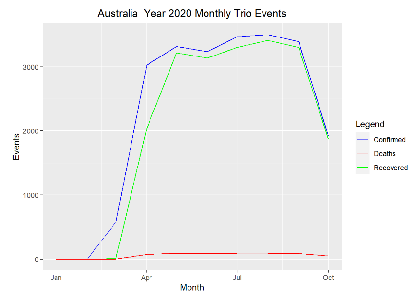

# covid-19-eda

# About Project
	* Exploring Covid event trends in different countries
	* Practicing visualization with ggplot
	* Transforming data for PowerBI Dashboard

## Australia Capital Covid Events Trend

- Insight: Very few death. The recovery event line follows closely with the confirmed case event.

## PowerBI Dashboard

- Insight: Seems like cases peaked on September 2020. Then it started dropping off.
- Insight: Looks like Victoria was hit the hardest.
